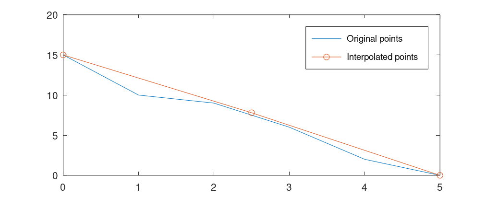
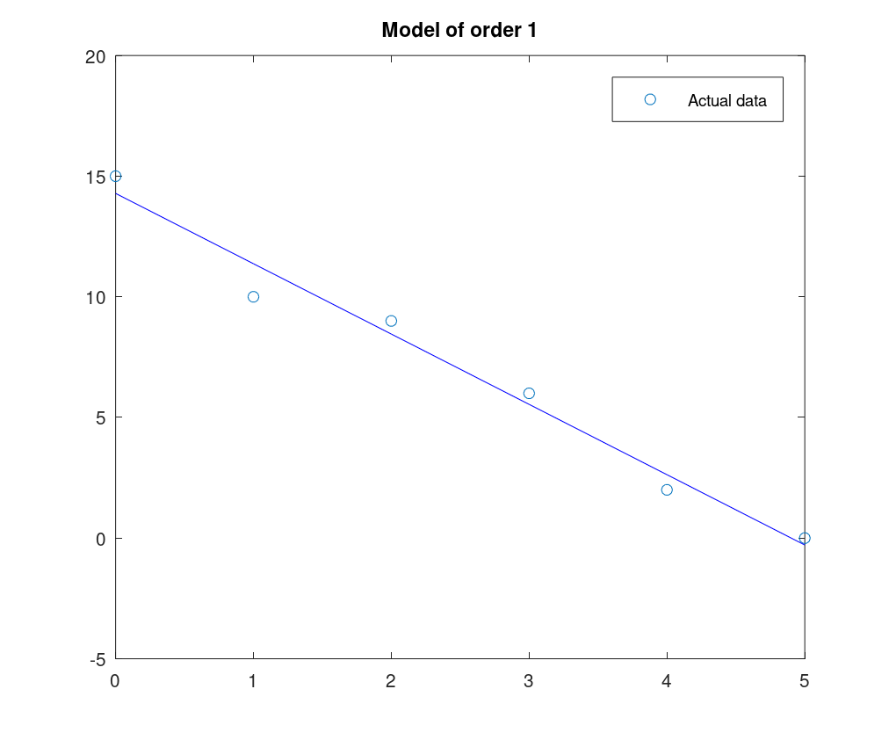
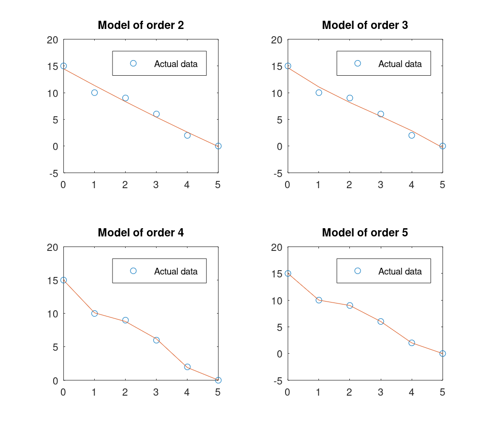
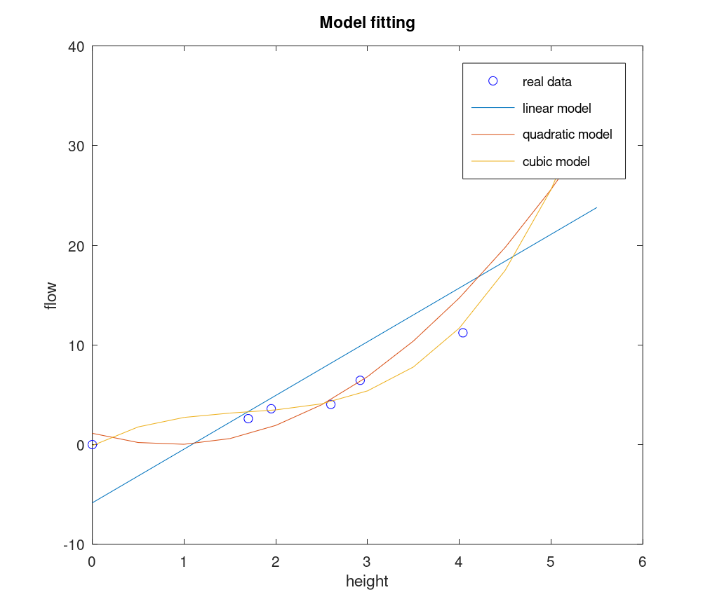
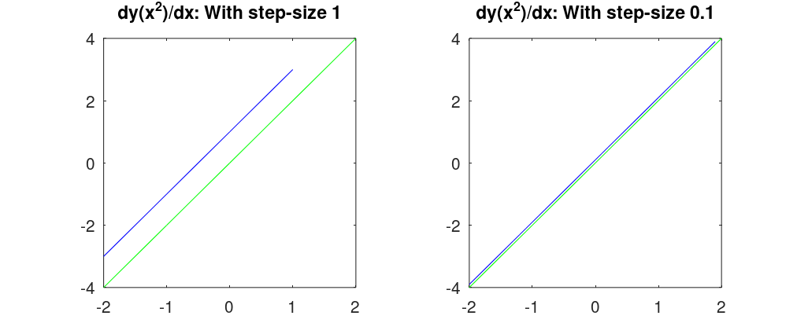
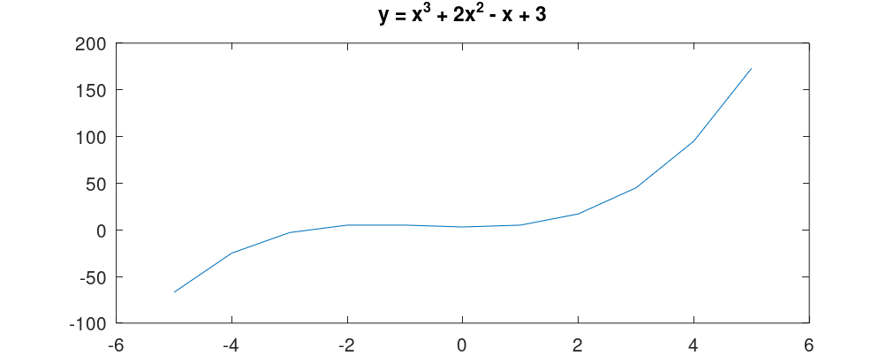
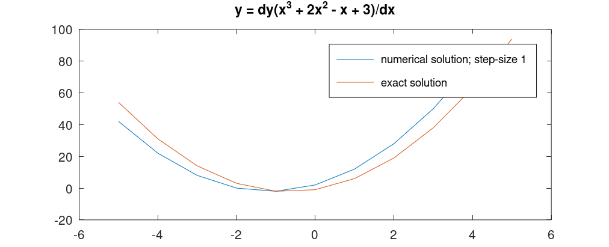

# Miscellaneous

I thought I should write some elaboration on some parts that could use it, and show resulting plots from `plot()`s used in the scripts

## Result of fprintf statements in curvfit_examples.m

Script snippet:

```MATLAB
x = 0:5;
y = [15, 10, 9, 6, 2, 0];

for n = 2:5
  p = polyfit(x, y, n);

  % Print the resulting regression models
  fprintf('\ny_%d(x) = %.2fx^%d', n, p(1), n);
  for i = (n-1):-1:0
    fprintf(' %+.2f', p(n-i+1));
    if i > 0
      fprintf('x');
      if i > 1
        fprintf('^%d', i);
      end
    end
    fprintf(' ');
  end
end
```

Result:

```
y_2(x) = 0.05x^2 -3.18x  +14.46
y_3(x) = -0.06x^3 +0.54x^2  -4.07x  +14.66
y_4(x) = 0.19x^4 -1.94x^3  +6.30x^2  -9.43x  +14.98
y_5(x) = -0.04x^5 +0.71x^4  -4.21x^3  +10.29x^2  -11.75x  +15.00
```

## Figure handles

I assigned each `figure()` to a handle so I can save them easily with `saveas()` when each figure is still opened. E.g.:

```MATLAB
% From interpolation_examples.m
saveas(interp_plot, 'interp_plot.png');

% From curvfit_examples.m
saveas(lin_regression, 'lin_regression.png');
saveas(poly_regression, 'poly_regression.png');

% From model_fitting_examples.m
saveas(model_fitting, 'model_fitting.png');

% From numerical_differentiation_examples.m
saveas(num_diff_on_quadratic, 'num_diff_on_quadratic.png');
saveas(before_num_diff_on_polynomial, 'before_num_diff_on_polynomial.png');
saveas(after_num_diff_on_polynomial, 'after_num_diff_on_polynomial.png');
```

Results:<br>

From [interpolation_examples.m](interpolation_examples.m)<br>
<br>

From [curvfit_examples.m](curvfit_examples.m)<br>
<br>
<br>

From [model_fitting_examples.m](model_fitting_examples.m)<br>
<br>

From [numerical_differentiation_examples.m](numerical_differentiation_examples.m)<br>
<br>
<br>
<br>